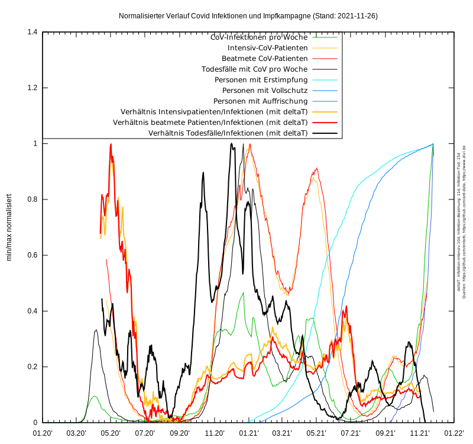

# Überprüfung der Wirksamkeit der CoVid Impfkampagne in Deutschland auf Basis zugänglicher Daten
## Qualitative Darstellung (regelmäßig aktualisiert)

Datenquellen:
- https://github.com/entorb/COVID-19-Coronavirus-German-Regions/
- https://github.com/ard-data/2020-rki-impf-archive
- https://www.divi.de/divi-intensivregister-tagesreport-archiv-csv

Basierend auf Sourcen von https://github.com/entorb/COVID-19-Coronavirus-German-Regions/